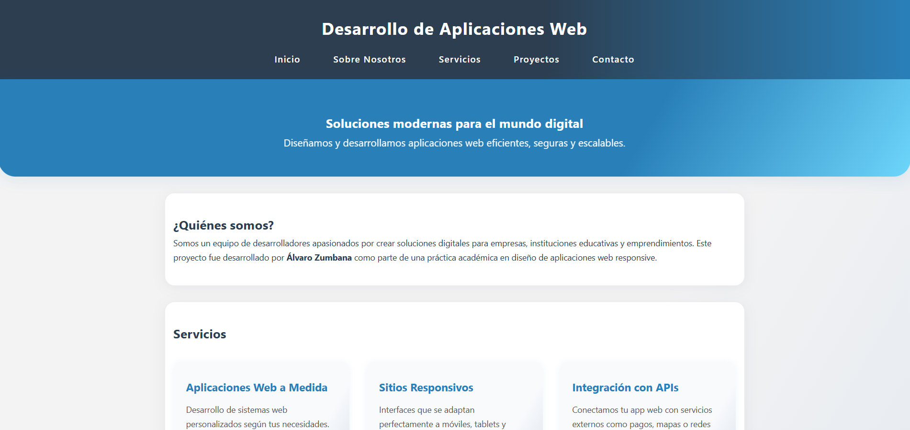
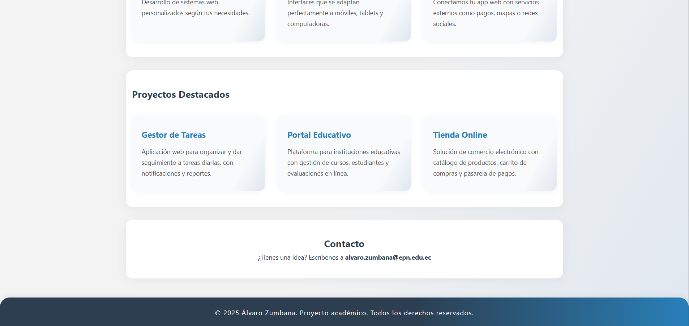

# 📄 Proyecto: Página Web Responsive de Aplicaciones Web

---

## Nombre del Proyecto

**Aplicaciones Web - Página Responsive desde Cero**

---

## Descripción

Este proyecto consiste en una **página web responsive** diseñada completamente con **HTML5 y CSS3**, sin librerías externas. El tema se centra en el desarrollo de **aplicaciones web modernas**, simulando un sitio de una empresa de tecnología. Incluye secciones informativas, diseño adaptable y código limpio, ideal como ejemplo académico.

---
## Vistas

### Sección 1


### Sección 2



## Autor

Desarrollado por **Álvaro Zumbana** como parte de una práctica académica sobre diseño y desarrollo de aplicaciones web responsivas.

---

## Objetivos del Proyecto

- Crear una interfaz web moderna y adaptable.
- Utilizar HTML semántico y CSS con buenas prácticas.
- Demostrar conocimientos de diseño responsive.
- Presentar un sitio profesional simulado para una empresa tecnológica.

---

## Estructura del Proyecto

```
mi_web_app/
├── index.html   # Página principal
├── style.css    # Estilos del sitio
└── README.md    # Documentación del proyecto
```

---

## 🚀 Instrucciones para Ejecutar usando `http-server` con Node.js

1. Asegúrate de tener Node.js instalado.
2. Abre la terminal en la carpeta del proyecto.
3. Ejecuta:

    ```bash
    npm install -g http-server
    http-server -c 10
    ```

4. Abre el navegador en [http://127.0.0.1:8081](http://127.0.0.1:8081) o la IP local que te indique.

---
